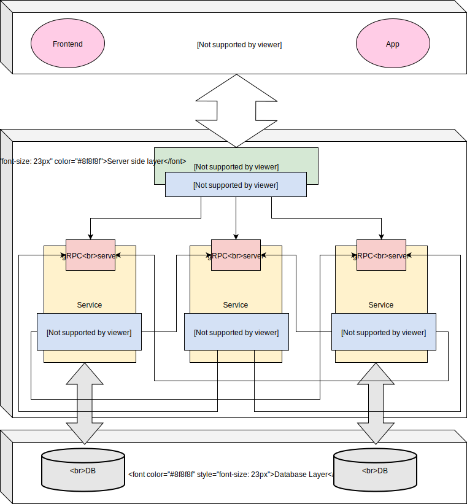

Документация разработчика
=========================

.. toctree::
   :caption: Оглавление
   :maxdepth: 2
   :numbered:

   book

Структура проекта
-----------------

Проект реализован с использованием микросервисной архитектуры. Сервисы связаны между собой через gPRC. Клиентские
приложения общаются с бекендом по REST API.

Сервисы
-------

book
   Отвечает за справочну информацию

auth
   Отвечает за авторизацию/аутентификацию пользователей и разграничение прав доступа (ALC)

api
   Предоставляет REST API интерфейс для взаимодействия с клиентскими приложениями

game
   Основной сервис, отвечающий за бизнес логику игры

ml
   Сервис предсказаний на основе машинного обучения

notify
   Сервис, отвечающий за уведомления

front
   Frontend проекта

docs
   Документация проекта

tarantool
   Key-value хранилище

postgres
   Сервис баз данных для проекта

metabase
   Интерфейс для работы с бд, визуализация статистики

Features
--------

ChangeLog
---------

